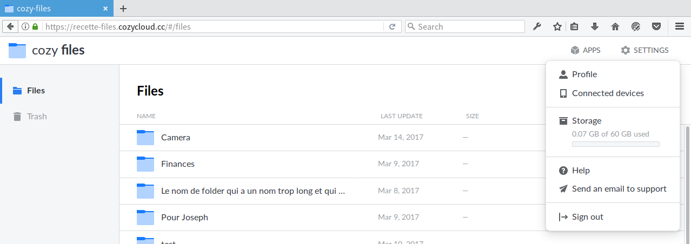
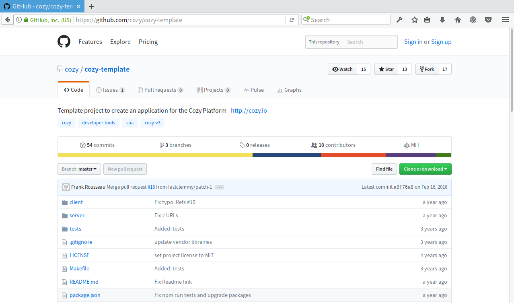

name: cover
class: middle

# Cozy DevTools

![:ref]


---
name: speaker
class: center


# m4dz

**Happy Dev UI & Quality defender**

.extras[
[m4dz.net](https://m4dz.net) | [@m4d_z](https://twitter.com/m4d_z) | PGP [0xD4627C417D969710](http://m4dz.net/0xD4627C417D969710.asc)
]


.org[
## 

.extras[
  [cozy.io](https://cozy.io)
]
]


---
layout: false
class: section bottom
background-image: url(../img/placeholders/bulb.jpeg)

# Petit rappel


---
layout: true

.breadcrumb[Petit rappel]


---
class: middle center

# JavaScript tooling : c'est compliqué…


---
class: middle

# … et je n'ai que 15' ⏰

- on va parler des apps uniquement
- le tour n'est pas exhaustif
- on met en place de façon itérative


---
class: middle stickit inverse

# Objectif

- équiper les devs d'apps en interne
- faciliter le bootstrap d'applications v3
- choisir la bonne boite à outils


---
class: single middle center

.left[
# 🚀

## Fonctionnalité à venir
]

.right[
# ☢

## Dans les cartons, à explorer
]


---
layout: false
class: section bottom
background-image: url(../img/placeholders/pencil-eraser-and-ruler.jpeg)

# Concevoir de l'applicatif web


---
layout: true

.breadcrumb[Concevoir de l'applicatif web]


---
class: middle

# Une codebase mutualisée

- utilisée par les applis web
- packagée pour le mobile
- ☢ en appli desktop (electron…)


---
class: middle

# Librairies internes

- [cozy-client-js](https://github.com/cozy/cozy-client-js) : interface vers la stack<br>`cozy.{client,files,photos…}`
- [cozy-bar](https://github.com/cozy/cozy-bar)

.small.center[]

- [cozy-ui](https://github.com/cozy/cozy-ui/) : styles et composants distribués

---
class: middle

# Les choix techniques front

- Preact + Preact-compat
- Jest
- Stylus
- i18n : dict JSON
- SVG / 🚀 WebWorkers / 🚀 Offline / etc


---
class: tiles, middle

# Distribuer pour le web

-  build
-  bundle
-  package


---
layout: false
class: section bottom
background-image: url(../img/placeholders/flowers-teddy-bear-toy.jpeg)

# Partager un socle commun


---
layout: true

.breadcrumb[Partager un socle commun]


---
class: middle

# Le build : Webpack configs

- fichiers de config modulaires
```txt
config
├── webpack.config.base.js
├── webpack.config.cozy-ui.js
├── webpack.config.dev.js
├── webpack.config.preact.js
└── webpack.config.prod.js
```
- définitions de targets
```txt
config
├── webpack.target.browser.js
└── webpack.target.mobile.js
```


---
class: middle

# Le build : environnements

- export des variables
```txt
config
└── webpack.vars.js
```
- flip sur les variables d'environnement
```js
const production = /:production$/.test(process.env.NODE_ENV)
const target = process.env.NODE_ENV.match(/^(\w+):/)[1]
```
```sh
$ NODE_ENV=browser:production npm run commons:build
```


---
class: middle

# Les dépendances : Yarn

- plus rapide et plus fiable que NPM
- versionne au commit près
- utilise une arborescence à plat


---
class: middle

# La transpilation : Babel

- cible précisément les navigateurs
- polyfill automatique
- complexe à optimiser en build

```json
  "presets": [
    ["env", {
      "targets": {
        "chrome": 42,
        "browsers": ["last 2 versions"]
      },
      "useBuiltIns": true
    }],
    "react"
  ]
```


---
class: middle

# L'optim CSS : PostCSS

- autoprefixer
- améliorations en vrac (MQPack, minification, etc)
- config distributable
- extensible


---
class: middle inverse

# **One ring to rule them all**

## [Cozy-template](https://github.com/cozy/cozy-template/tree/preact)

- configs de base (webpack, yarn, babel, postcss…)
- frameworks (preact, jest, polyglot…)
- docs (readme, contributing…)
- [_hello world_](https://github.com/cozy/cozy-template/tree/preact/src)


---
layout: false
class: section middle
background-image: url(../img/placeholders/construction-work-carpenter-tools.jpg)

# Local DevTools


---
layout: true

.breadcrumb[Local DevTools]


---
class: middle

# Les scripts Yarn / NPM

- des tâches haut-niveau
- exécutions shell / env
- découpage en micro-scripts
- encapsule l'environnement Node.js


---
class: middle

# Common tasks

- `build` / `build:<target>`<br><small>(`browser` par défaut)</small>
- `watch` / `watch:standalone`
- `test`


---
class: middle

# Cas du watch

- versions non-minifiées
- build sur le FS (en RAM pour `standalone`)


---
layout: false
class: section middle
background-image: url(../img/placeholders/industry-grinder-steel-no-person.jpg)

# Outils externes


---
layout: true

.breadcrumb[Outils externes]


---
class: middle

# Code

- [Github](https://github.cm/cozy)
- 🚀 Gitlab / Framagit


---
class: middle

# i18n

- [Transifex](transifex.com/cozy)
- [Polyglot](http://airbnb.io/polyglot.js/)
- [date.fns](https://date-fns.org/)


---
class: middle

# Intégration Continue

- [Travis](https://travis-ci.org/cozy)
- [🚀 Browserstack](https://www.browserstack.com/)
- [🚀 Greenkeeper](https://greenkeeper.io/)


---
layout: false
class: section
background-image: url(../img/placeholders/man-on-bench.jpeg)

# 🚀 McFly


---
layout: true

.breadcrumb[🚀 McFly]


---
class: middle stickit inverse

# Objectif

- abaisser la marche d'entrée
- améliorer la maintenance / évolution
- faciliter les contributions
- s'ouvrir aux communautées


---
class: middle

# Hot Module Reload (**HMR**)

- uniquement disponible en `standalone`
- à intégrer à la stack
- uniquement en mode dev


---
class: middle

# Sourcemaps

- inconsistences à résoudre
- temps de (re)build à améliorer
- support correct des [CSS Modules](https://github.com/css-modules/css-modules)


---
class: middle

# Webpack@2.x

- webpack@1.x est maintenant _deprecated_
- expérimentation en cours sur la cozy-bar
- ☢ essais sur [rollup.js](http://rollupjs.org/)


---
class: middle

# Générateur de templates / configs

- distribuer les configs externes dans des modules
- (re)générer `package.json` à la volée
- scaffold / boostrap d'application
- ☢ supports d'autres frameworks


---
class: middle

# Documentations

- 🚀 KSS automatique + template
- Demo app
- ☢ Storybook


---
layout: false
class: section right
background-image: url(./simpson-help-me.gif)

# Aidez-nous =] !


---
class: center

.large[]

_Ouvrez des issues et contribuez au template_

---
layout: false
class: section, bottom
background-image: url('../img/placeholders/collaborate.jpg')

# Questions ?


---
name: thanks

# Merci !

## Iconographie / Médias

- Icônes : [Linea](http://linea.io/) - [CC BY 4.0](http://creativecommons.org/licenses/by/4.0/)

## Fontes

- Titrage : [Sinzano](http://typodermicfonts.com/sinzano/) by Typodermic http://typodermicfonts.com - [Fontspring webfont EULA](https://www.fontspring.com/licenses_text/lv4e5lv2k2)
- Intertitres & labeur : [Source Sans Pro](https://github.com/adobe-fonts/source-sans-pro) by Adobe https://github.com/adobe-fonts - [Open Font Licence](https://raw.githubusercontent.com/adobe-fonts/source-sans-pro/master/LICENSE.txt)
- Monospace : [Source Code Pro](https://github.com/adobe-fonts/source-code-pro) by Adobe https://github.com/adobe-fonts - [Open Font Licence](https://raw.githubusercontent.com/adobe-fonts/source-code-pro/master/LICENSE.txt)

## Outils

- Moteur de présentation : [Remark](https://github.com/gnab/remark)

.licence[


![:ref]

disponible sous licence [CC BY-SA 4.0](http://creativecommons.org/licenses/by-sa/4.0/)
]
