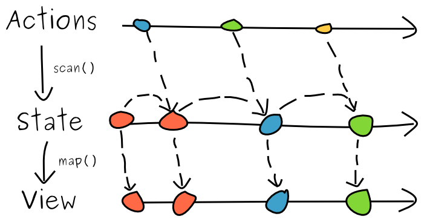
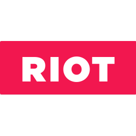

name: cover
class: middle

# Functional Web Apps

Bring power and stability to your apps

![:ref]


---
name: speaker
class: center


# m4dz

**Happy Dev UI & Quality defender**

.extras[
[m4dz.net](https://m4dz.net) | [@m4d_z](https://twitter.com/m4d_z) | PGP [0xD4627C417D969710](http://m4dz.net/0xD4627C417D969710.asc)
]


.org[
## 

.extras[
  [cozy.io](https://cozy.io)
]
]


---
class: section, center
background-image: url(../img/placeholders/trees-building.jpg)

# The actual way


---
layout: true

.breadcrumb[The actual way]


---
class: middle, center

# Building web apps, the old fashioned


---

class: middle

# Libs & Frameworks

- jQuery
- Backbone, Aurelia, Ampersand…
- Angular, Ember…

.center.small[]


---
class: middle, center

# The Modern way


---
class: stickit, middle, center, inverse

# React 🎉


---
class: middle

# React problems <small>(imho)</small>

- not truly reactive
- desperately bloated
- monocultural

--

.center.small[]


---
class: middle

# The long tail

- Angular 2
- Cycle.js
- Riot
- Meteor

[The state of JavaScript 2016](
https://medium.com/@sachagreif/the-state-of-javascript-front-end-frameworks-1a2d8a61510) - Medium, by _Sacha Greif_

---
layout: false
class: section, middle
background-image: url(../img/placeholders/person-looking-searching-clean.jpg)

# Functional


---
layout: true

.breadcrumb[Functional]


---
class: single, inverse, middle

# Permaculture


---
class: middle, center

# Think Different™


---

# Functional programming

- _What?_ All about functions

```js
function foo(x, y, z) {
  y = y * x
  z = z * x
  return [y, z]
}
```

???

- Functional programming is about using functions as units of abstraction and composing them to build a system


---

# Functional programming

- _What?_ All about functions
- _How?_ All about composition

```js
function sum(x, y) { return x + y }
function mult(x, y) { return x * y }
var multAndSum = compose(mult, sum)
// 5 + (3 * 4)
multAndSum(3, 4, 5)
```


---
# Functional programming

- _What?_ All about functions
- _How?_ All about composition
- _Why?_ Immutability, Closure, Recursion…

(basically, it's all about `map/reduce`)


---
class: single, middle, inverse

# Simplicity


---
class: single, middle, inverse

# Flexibility


---
class: single, middle, inverse

# Predictability


---
class: single, middle, inverse

# Testability


---
layout: false
class: section, middle, center
background-image: url(../img/placeholders/construction-work-carpenter-tools.jpg)

# Reactive logics


---
layout: true

.breadcrumb[Reactive logics]


---
class: middle

# Streams & Cells

.large[]

[JavaScript Reactive Programming](https://vincenttunru.com/Javascript-reactive-programming/) by _Vincent Tunru_


---
class: single, middle, center

# We need libs!


---
class: tiles, logos, middle

-  Kefir (Ramda)
-  RxJS
-  Bacon

---
class: single, middle, inverse

# Most.js

[github://cujojs/most](https://github.com/cujojs/most)


---
class: middle

# Go behind the DOM

- Service Workers

--

- Push Notifications

--

- Websockets


---
layout: false
class: section, middle
background-image: url(../img/placeholders/tools.jpg)

# Be visual


---
layout: true

.breadcrumb[Be visual]


---
class: single, middle, inverse

# **Use a simple, unique, source of truth**


---
class: single, middle

# Don't focus on mutability vs immutability


---
class: middle, center

# Choose your data store and keep it clean


---
class: single, middle

# Use Reactive Ui


---
class: tiles, logos, middle

-  Vue.js
-  Riot


---

# Back to dedicated concerns

- JS Views display data

--

- HTML stores Ui states (ARIA)

--

- CSS power animations and transitions

--

- WebAnimation and WebGL for high demand refresh rendering


---

# Functional by design

- Atomic Design
- CSS Modules

.center[]

---
layout: false
class: section, middle, right
background-image: url(../img/placeholders/portrait-bird-nature-wild.jpg)

# Is it a bird?


---
layout: true

.breadcrumb[Is it a bird?]


---
class: single, middle

# Will it become too complex?


---
class: stickit, middle

# So, why not using Elm?

or Cycle.js? Or any full-integrated framework/solution?


---
class: single, middle, inverse

# Be small and agnostic <sup>(<abbr title="Keep It Simply Simple">KISS</abbr>)</sup>


---
class: single, middle, inverse

This is just…

# **Unix philosphy**


---
layout: false
class: section, bottom
background-image: url('../img/placeholders/collaborate.jpg')

# Questions?


---
name: thanks

# Thanks!

## Iconography / Medias

- Icons: [Linea](http://linea.io/) - [CC BY 4.0](http://creativecommons.org/licenses/by/4.0/)

## Fonts

- Titles: [Sinzano](http://typodermicfonts.com/sinzano/) by Typodermic http://typodermicfonts.com - [Fontspring webfont EULA](https://www.fontspring.com/licenses_text/lv4e5lv2k2)
- Subtitles & labor: [Source Sans Pro](https://github.com/adobe-fonts/source-sans-pro) by Adobe https://github.com/adobe-fonts - [Open Font Licence](https://raw.githubusercontent.com/adobe-fonts/source-sans-pro/master/LICENSE.txt)
- Monospace: [Source Code Pro](https://github.com/adobe-fonts/source-code-pro) by Adobe https://github.com/adobe-fonts - [Open Font Licence](https://raw.githubusercontent.com/adobe-fonts/source-code-pro/master/LICENSE.txt)

## Tools

- Presentation engine: [Remark](https://github.com/gnab/remark)

.licence[


![:ref]

Licensed under [CC BY-SA 4.0](http://creativecommons.org/licenses/by-sa/4.0/)
]
