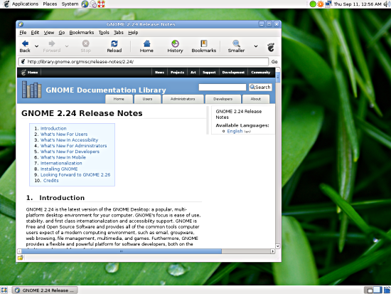
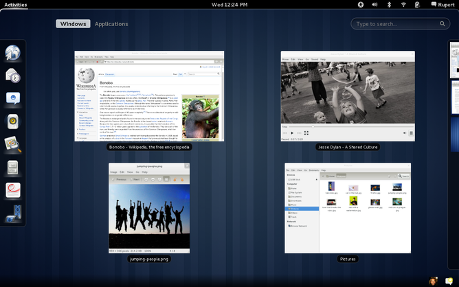
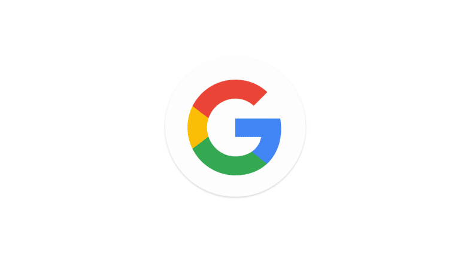
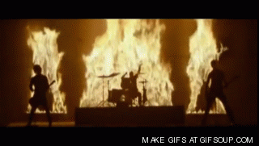
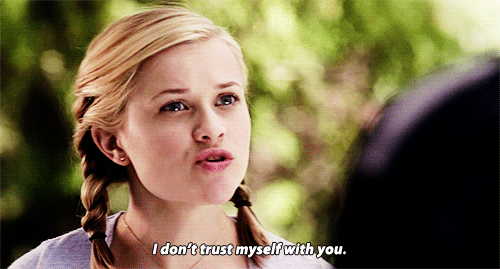
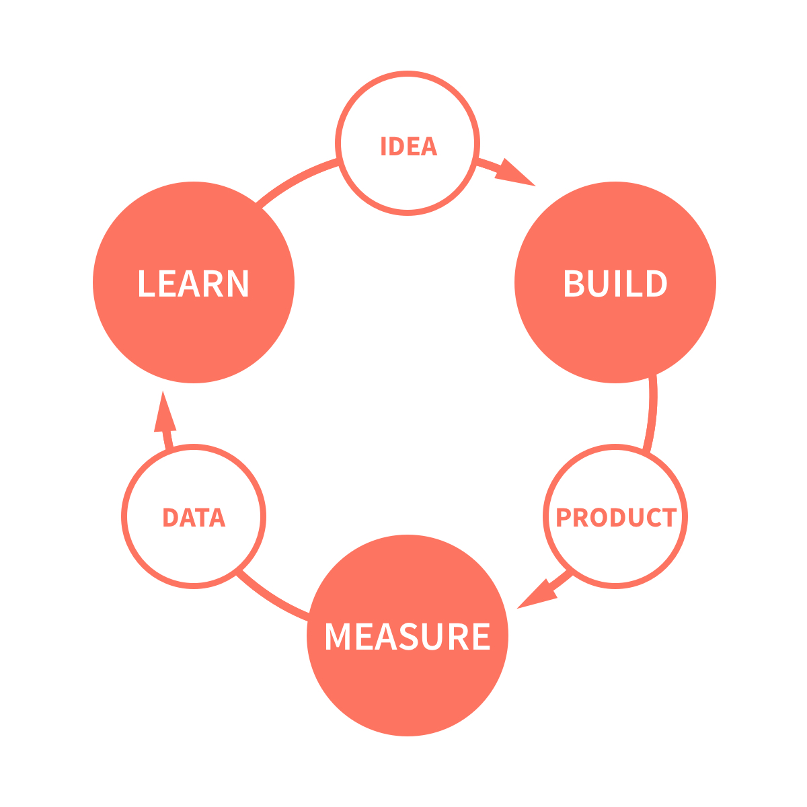

name: cover
class: middle

# L'ergonomie, indispensable à l'adoption massive du libre

![:ref]

---
name: speaker
class: center speakers

.speaker[

# Luc Chaffard

**Product Designer**

.extras[
[@kelukelu](https://twitter.com/kelukelu)
]
]

.speaker[

# m4dz

**Happy Dev UI & Quality defender**

.extras[
[m4dz.net](https://m4dz.net) | [@m4d_z](https://twitter.com/m4d_z) | PGP [7D969710](http://m4dz.net/7D969710.asc)
]
]

.org[
## 

.extras[
  [cozy.io](https://cozy.io)
]
]

---
class: middle, center, single, inverse, sp-m4dz

.large[]

???
Le vieux bureau Gnome - 2002

---
class: middle, center, single, inverse, sp-m4dz

.large[]

???
Le nouveau bureau Gnome - 2011

---
class: inverse, single, middle, sp-luc

# **L'adoption de masse passe par une évolution des produits pour les rendre accessibles**

???
- e.g. google, le mechant

---
class: middle, center, sp-luc

.small[]

---
class: section
background-image: url(../img/placeholders/rails-man-person-walking.jpg)

# L'Open-Source, l'Ergo & le Designer

---
layout: true

.breadcrumb[L'Ergo, l'Open-Source, & le Designer]

---
class: single, middle, sp-m4dz

# Statut de la relation :
--
 c'est compliqué

---
class: middle, center, stickit, sp-luc

# Des process d'install compliqués

???
- bac + 15
- commun des mortels abandonne

---
class: middle, center, stickit, sp-luc

# Des outils difficiles à digérer

???
- interface incomprehemsible
- logique pour ingenieur
- non utilisable

---
class: middle, center, stickit, sp-m4dz

# Un manque de confiance

---
class: stickit, middle, center, sp-m4dz

# Une relation égosexuelle

???
Challenge : ça se pignole tout seul

---
class: single, inverse, middle, sp-m4dz
# Apprenons à _vivre_ ensemble

???
- souci de savoir-être
- inclusivité sur les projets

---
class: single, inverse, middle, sp-luc

# Apprenons à _travailler_ ensemble

???
- manque de culture
- amorcer du dialogue
- faire transpirer les valeurs
- brander sa philosophie

[MDN redesign]( https://blog.mozilla.org/jay/2010/02/09/developing-the-mdn-brand/ )

---
class: punchline, bottom, sp-m4dz

.round[]

> Si l'Open-Source ne parvient en fin de compte qu'à libérer du code source, alors tout ça aura été vain.

RMS <small>_(à peu près, et je sais plus où ; si quelqu'un retrouve, j'offre les câlins…)_</small>

???
Retrouver la source

---
layout: false
class: section, right
background-image: url(../img/placeholders/primate-ape-thinking-mimic.jpg)

# Ergo, kézako ?

---
layout: true

.breadcrumb[Ergo, kézako ?]

---
class: middle, sp-luc

# UX: Définition

* Experience des utilisateurs au sein de votre solution
* Usage sans friction
* Se concentrer sur la solution, pas sur le fonctionnement

---
class: stickit, center, middle, inverse, sp-luc

# MAKING USERS BADASS

???
- comprendre la valeur ajoutée de votre solution à la 1ere utilisation

---
class: middle, sp-m4dz

# C'est qui l'utilisateur ?

* Bien connaître son marché
* Moi parmi tant d'autres

---
class: middle, sp-m4dz

# Un parcours utilisateur, c'est quoi ?

* The killer feature
* Comment on y accède ?
* Comment on l'utilise ?

---
class: middle, tiles, center, sp-luc

# Design vs Ergo

*  Design (UI) la partie visuelle
*  Ergo (UX) la partie comportementale

???
- UI : bouton bleu, parce que le bleu renvoie à…
- UX : ce bouton sera placé à cet endroit sur cette page, parce que c'est l'action primordiale

---
class: middle, tiles, center, sp-luc

# Bullshit or Not?

*  améliore la satisfaction
*  augmente la rétention
*  réduit les couts de développement

---
class: single, middle, sp-luc

# **Une solution sur mesure pour vos utilisateurs**

???
- plus de supposition
- des donnees pour valider

---
layout: false
class: section
background-image: url(./c_est_pas_sorcier.jpg)

# Komenkonfé ?

---
layout: true

.breadcrumb[Komenkonfé ?]

---
class: middle, sp-m4dz

# User Centric Design

- Travailler avec les users
- Synthétiser
- Croiser
- Conceptualiser

---
class: middle, sp-m4dz

# Trouvez vos _adeptes_

- Forum
- IRC
- Twitter
- …

---
class: middle, sp-m4dz

# Interviewez

* Face à face / visionconf
* Définir un objectif
* Rester neutre
* Parler de l'usage (pas de solution)
* Prendre des notes

???
- commencer par des banalités
- ne pas prendre les notes en face à face

---
class: middle, sp-luc

# Analysez le Feedback

* Collecter
* Extraire
* Croiser
* Apprendre

???
- extraire -> demande VS besoin
- apprendre -> challenger ses hypotheses

---
class: middle, sp-luc

# Designez / Prototypez

* Concrétiser les concepts
* Utiliser des prototypes dynamiques
* Tester rapidement sans développement

???
- proto -> outils comme Marvel ou Invision

---
class: middle, sp-luc

# GOTO: Feedback

* Collecter
* Extraire
* Croiser
* Apprendre

--
* Itérer / Améliorer / Réparer / Développer

--
* Répéter

---
class: middle, center, inverse, sp-luc

# Cycle Lean

---
class: punchline, bottom, sp-m4dz

.round[]

> If I had asked people what they wanted, they would have said faster horses.

Henry Ford

???
- besoin ≠ demande

---
class: middle, sp-m4dz

# Pour faire simple…

- Diversifiez les canaux
- Apprenez de vos utilisateurs
- Gardez le contrôle de votre solution

???
- Github / Forum / IRC…

---
layout: false
class: section, middle
background-image: url(../img/placeholders/flowers-teddy-bear-toy.jpeg)

# Soyez inclusifs

---
layout: true

.breadcrumb[Soyez inclusifs]

---
class: single, middle, sp-luc

# Nothing personal

???
- Tout le monde peut être un bon ergo
- L'affect biaise les jugements
- Les opinions individuelles ne sont pas toujours bonnes

---
class: single, middle, inverse, sp-m4dz

# **Ergo n'est pas Design**

???
- l'ergo fait appel à des notions tangibles
- le design est viscéral (lié à la culture, à l'image, etc)

---
class: single, middle, sp-m4dz

# Open-sourcer le Design&nbsp;?

[Mozilla open-sourcing brand]()

---
layout: false
class: section, top
background-image: url('../img/placeholders/collaborate.jpg')

# Questions ?

---
name: thanks

# Merci !

## Iconographie / Médias :

- Icônes : [Linea](http://linea.io/) - [CC BY 4.0](http://creativecommons.org/licenses/by/4.0/)
- Gnome desktop screenshots : [Gnome Project Release Notes](https://help.gnome.org/misc/release-notes)
- Portraits [Henry Ford](https://en.wikipedia.org/wiki/File:Henry_ford_1919.jpg) & [Richard Stallman](https://en.wikipedia.org/wiki/File:Richard_Stallman_-_F%C3%AAte_de_l%27Humanit%C3%A9_2014_-_010.jpg): Wikimédia

## Fontes :

- Titrage : [Sinzano](http://typodermicfonts.com/sinzano/) by Typodermic http://typodermicfonts.com - [Fontspring webfont EULA](https://www.fontspring.com/licenses_text/lv4e5lv2k2)
- Intertitres & labeur : [Source Sans Pro](https://github.com/adobe-fonts/source-sans-pro) by Adobe https://github.com/adobe-fonts - [Open Font Licence](https://raw.githubusercontent.com/adobe-fonts/source-sans-pro/master/LICENSE.txt)
- Monospace : [Source Code Pro](https://github.com/adobe-fonts/source-code-pro) by Adobe https://github.com/adobe-fonts - [Open Font Licence](https://raw.githubusercontent.com/adobe-fonts/source-code-pro/master/LICENSE.txt)

## Outils

- Moteur de présentation : [Remark](https://github.com/gnab/remark)

.licence[

![:ref]

disponible sous licence [CC BY-SA 4.0](http://creativecommons.org/licenses/by-sa/4.0/)
]
