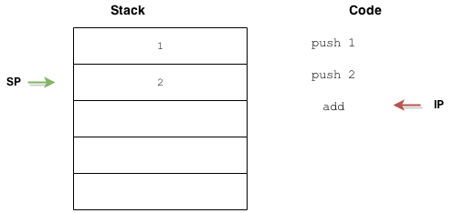
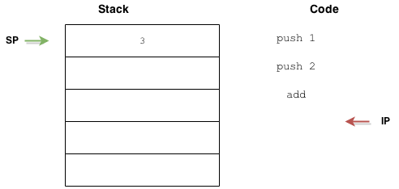

<!--{section^1:data-breadcrumb="Back to Basics"}-->

<!--{.interleaf data-background-image="/img/unsplash/kasya-shahovskaya-737394-unsplash.jpg"}-->
<!-- Photo by Kasya Shahovskaya on Unsplash -->

## <svg class="icon"><use xlink:href="/img/icons.svg#dots-two-vertical"></svg> Back to Basics: It's not that easy

===
<!--{ .left.xx-large }-->
### Stack Based VM

===

Stack based ::vs.::{.small} Register based {.large}
- Register: close to the CPU, powerful
- Stack: flexible, lightweight
- JVM, CLR &… JS JIT: Stack Based VM {.fragment .fade-up}

<!-- -->
- [Stack Based Virtual Machines](https://andreabergia.com/stack-based-virtual-machines/)
{.linkrolls}

===

Stack Based VM {.large}

{.bg .large}

===

Magic! {.large}

{.bg .large}


===
<!--{ .punchline }-->

The Stack is the ==main== point

???

all operations are stored into the stack

===
<!--{ .left .xx-large}-->

Operation: `(1 + 2 * 3) / 7`{.fragment}
Instructions: `1.`{.fragment}`2.`{.fragment}`3.MUL.`{.fragment}`ADD.`{.fragment}`7.`{.fragment}`DIV`{.fragment}

???

Reverse Polish notation

===

ASM! {.large}

```wasm
PUSH 1
PUSH 2
PUSH 3
MUL
ADD
PUSH 7
DIV
```

- https://andreabergia.com/stack-based-virtual-machines-8/
{.linkrolls}

===
<!--{ .left.xx-large }-->
### Logic ~~JS~~ Engine

===
<!--{ .x-large }-->

- SpiderMonkey
- V8
- Chakra
- JavaScriptCore (JSC)

===
<!--{ .x-large }-->

At start:{.large}
- JS VM Engine
- Interpreter
- Compiler JIT

===
<!--{ .left.xx-large }-->

JIT Compiler produces
machine code instructions
fastly, but is limited

===
<!--{ .large }-->

WASM uses the same ==Engine== {.large}
- quick exchanges with JS {.fragment}
- _unboxing_ {.fragment}
- monomorphic calls {.fragment}
- _built-ins_ methods {.fragment}

<!-- -->
- [Calls between JavaScript and WebAssembly are finally fast 🎉](https://hacks.mozilla.org/2018/10/calls-between-javascript-and-webassembly-are-finally-fast-%f0%9f%8e%89/)
{.linkrolls}

???

Monomorphic call: fn to fn call w/ the same args types to prevent boxing

===
<!--{ .left.xx-large }-->

Execution Engine able to
run **all** logic languages
directly on the Web!

===
<!--{ .left.xx-large }-->
### Rust

===

Why Rust? :{.large}
- C++, thanks, but I only have one brain {.fragment}
- No data-race, by design {.fragment}
- Static types {.fragment}
- Iterators {.fragment}
- Excellent Memory Management {.fragment}
- Community {.fragment}
- Toolchain (Rustup, Cargo, Rustc...) {.fragment}

===

Hello World
```rust
fn main() {
    // Print text to the console
    println!("Hello World!");
}
```

===

Modules By Design
```rust
mod sound {
    pub mod instrument {
        pub fn pouet() {
            // ...
        }
    }
}
```
```rust
fn main() {
    crate::sound::instrument::pouet();
}
```

===

Static Types & Iterators
```rust
mod squares {
    pub fn sum_from_zero( n<span class="fragment" data-fragment-index="1">: i32</span>) -> <span class="fragment" data-fragment-index="1">i32</span> {
        (<span class="fragment" data-fragment-index="2">0 ..= n</span>).<span class="fragment" data-fragment-index="3">fold</span>(0, <span class="fragment" data-fragment-index="4">|a, b| a + b</span>)
    }
}
```

===

Cargo
```sh
$ cargo build
   Compiling hello_world v0.1.0 (file:///path/to/package/hello_world)
```
```sh
$ cargo run
     Fresh hello_world v0.1.0 (file:///path/to/package/hello_world)
   Running `target/hello_world`
Hello, world!
```
