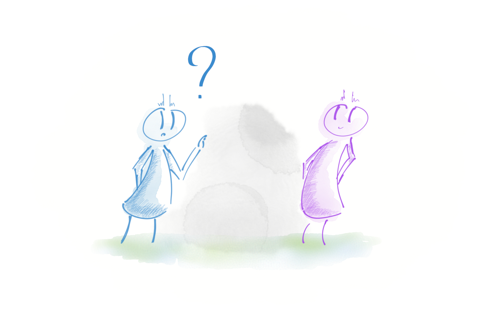
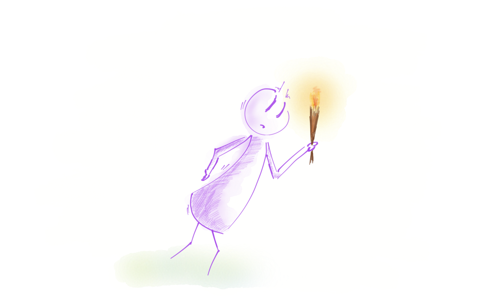
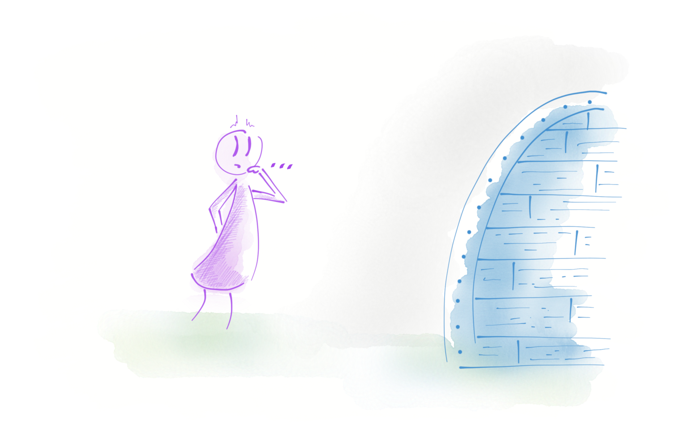
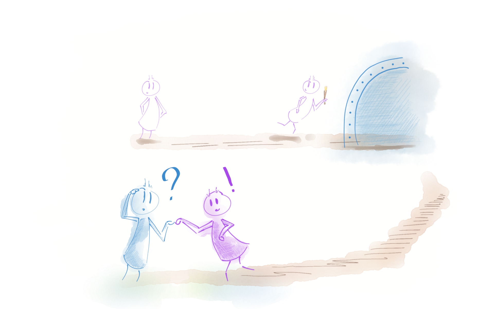

<!--{section^1:data-breadcrumb="Concepts"}-->

<!--{.interleaf data-background-image="/img/unsplash/71909.jpg"}-->
<!-- Photo by Patrick Tomasso on Unsplash -->

## <svg class="icon"><use xlink:href="/img/icons.svg#dots-two-vertical"></svg> Designing a Zero-Knowledge app

===

Data
: piece of information produced by the user

Client
: user's application

Service
: third-party app that need to access the data

Key-pair
: Cryptographic asymmetric keys (RSA / EC)

Certificate
: Client/Service Virtual ID card

Server
: Distributes the data/identities

===

### Core Concepts

- _Zero Knowledge Proof_ Authentication {.fragment}
- End to End Encryption {.fragment}
- Encrypted data only {.fragment}
- Non-naive approach {.fragment}
{.x-large}

===

### Meld them!

@[giphy]({"token": "26u4lOMA8JKSnL9Uk", "className":"medium"})

===

#### The Crypto Part

1. :fas-fingerprint: Password
2. :fas-id-card: Intermediate Certificate, signed with the app CER available on the server {.fragment .fade-up}
3. :fas-key: Two pairs : authentication (signature), data (encryption) {.fragment .fade-up}
4. :fas-server: Public Keys and Private Keys Hashes are uploaded to the server {.fragment .fade-up}
5. :fas-mobile-alt: Private Keys are stored in the Client with the Intermediate Certificate {.fragment .fade-up}
{.x-small .icons}

===
<!--{.punchline}-->

#### Zero Knowledge Proof Auth
<!--{h4:.large}-->

===

The Cave {.large}

::{.large .no-background .no-borders}::
::{.large .no-background .no-borders}::{.fragment .current-visible}
::{.large .no-background .no-borders}::{.fragment .current-visible}
::{.large .no-background .no-borders}::{.fragment .current-visible}
<!--{p:.over}-->

===

Registering a Service {.x-large}

- :fas-id-card: One Intermediate Certificate per Service {.fragment .fade-up}
- :fas-key: Two Keys-pairs per Service {.fragment .fade-up}
- :fas-handshake: The signature keys-pair is used for auth {.fragment .fade-up}

{.x-small .icons}

===

Zero Knowledge Proof {.x-large}

1. Service: Ask the Server for a new Client token {.fragment .fade-up}
2. Server: Pass the Token to the Service and the Client {.fragment .fade-up}
3. Service: Sign the Token and send it to the Client {.fragment .fade-up}
4. Client: Both check the signature and the Token {.fragment .fade-up}
{.medium}

===
<!--{.large}-->

**Security Concerns** {.large}

- No password exchanges
- Keys can be revoked using the Intermediate Certificates

===
<!--{.punchline}-->

#### End 2 End Encryption
<!--{h4:.large}-->

===
<!--{.large}-->

Encrypt {.large}

- Client side ==only== {.fragment .fade-up}
- Using the ==recipient Service== Public Key {.fragment .fade-up}
- With a unique symmetric Key wrapping {.fragment .fade-up}

===
<!--{.large}-->

Decrypt {.large}

- Service side {.fragment .fade-up}
- With the Service Private Key {.fragment .fade-up}

===
<!--{.large}-->

**Security Concerns** {.large}

- Each symmetric key is unique per Blob/Service/Client
- The symmetric key is a _datetime token_

===
<!--{.punchline}-->

#### Non-naive approach
<!--{h4:.large}-->

===

Document: a Tree Structure

<svg width="600" height="600" viewBox="0 0 200 200" xmlns="http://www.w3.org/2000/svg"><path d="M137.33 35.14a4.05 4.05 0 0 0 4.04 4.05h29.77c-.31-.4-.61-.82-.97-1.18L138.51 6.35c-.36-.36-.78-.66-1.18-.97v29.76zm0 0" fill="#fff"/><path d="M140.37 47.27c-6.69 0-12.13-5.44-12.13-12.13V2.79H39.31c-6.72 0-12.13 5.46-12.13 12.13v169.61c0 6.67 5.41 12.13 12.13 12.13l117.65.08c4.2 0 8.16-1.62 11.15-4.61 2.96-2.95 4.61-6.92 4.61-11.12V47.27h-32.35zm0 0" stroke-width="4" stroke="#fff" stroke-linecap="round" stroke-linejoin="round" fill="none"/><path d="M51.43 43.17h32.34v8.09H51.43v-8.09zm0 0" stroke-width="4" stroke="#fb0006" stroke-linecap="round" stroke-linejoin="round" fill="#fb0006" class="fragment"/><path d="M51.43 67.43h97.03v8.09H51.43v-8.09zm0 0M51.43 91.69h97.03v8.08H51.43v-8.08zm0 0" stroke-width="4" stroke="#f90" stroke-linecap="round" stroke-linejoin="round" fill="#f90" class="fragment"/><path d="M75.68 172.55H51.43v-8.09h24.25v8.09zm0 0M91.86 148.29H51.43v-8.09h40.43v8.09zm0 0M108.03 124.03h-56.6v-8.08h56.6v8.08zm0 0" stroke-width="4" stroke="#09f" stroke-linecap="round" stroke-linejoin="round" fill="#09f" class="fragment"/><path d="M156.54 173.54c0 4.46-3.62 8.09-8.08 8.09h-28.3c-4.46 0-8.09-3.63-8.09-8.09v-37.38c0-4.46 3.63-8.09 8.09-8.09h28.3c4.46 0 8.08 3.63 8.08 8.09v37.38zm0 0" stroke-width="4" stroke="#0c0" stroke-linecap="round" stroke-linejoin="round" fill="#0c0" class="fragment"/><path d="M136.46 75.52h-24v-8.09h24v8.09zm0 0M136.46 99.77h-24v-8.08h24v8.08zm0 0" stroke-width="4" stroke="#f0c" stroke-linecap="round" stroke-linejoin="round" fill="#f0c" class="fragment"/></svg>

===

**Security Concerns** {.x-large}

- Never share all the doc
- Smallest amount of Data possible
- Forbidden resources stay safe
{.medium}
