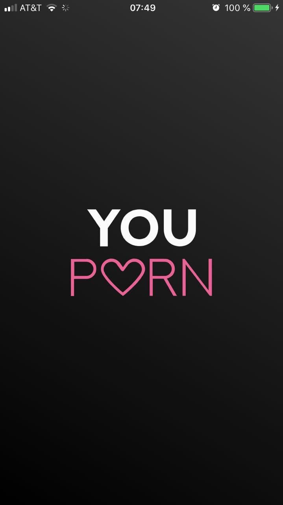

<!--{section^1:data-breadcrumb="Implémentation"}-->

<!--{.interleaf data-background-image="/img/unsplash/175638.jpg"}-->
<!-- Photo by Lacey Williams on Unsplash -->

## <svg class="icon"><use xlink:href="/img/icons.svg#dots-two-vertical"></svg>Frameworks, Tools, Use-cases

===

@[giphy]({"token": "Zo9ACzmJgoqRy", "caption": "It's not that easy", "className":"large"})

===

~~Frameworks~~
{.xx-large}

- [SignalProtocolKit::SessionBuilder](https://github.com/langboost/libsignal-protocol-pcl/blob/master/signal-protocol-pcl/SessionBuilder.cs)
- [CossackLabs](https://www.cossacklabs.com/)
- [CryptPad](https://github.com/xwiki-labs/cryptpad)
{.linkrolls}

===

### Backend

Standard File
{.xx-large}

- [Standard File Protocol](https://github.com/standardfile)
- [Standard Notes](https://standardnotes.org/)
{.linkrolls}

===

### Mobile / Desktop

- Binaries
- Store the Keys in the Filesystem
- Controlled environment
- Protected against malware
{.large}

===
<!--{.punchline}-->

### Web Browser/PWA
<!--{h3:.large}-->

===

{.x-small}

===
<!--{.large}-->

CORS

- Prevent requests from unknows
- Prevent unauthorized access
- → Sandbox network exchanges {.fragment .fade-up}

===
<!--{.large}-->

CSP

- Forbid unwanted document write 
- Explicitely allow resources
- Prevent XSS injection / Data leak
- → Protect application integrity {.fragment .fade-up}

===
<!--{.large}-->

SRI

- Verify assets checksum
- Prevent MITM attack
- → Guarantees external resources integrity {.fragment .fade-up}

===
<!--{.large}-->

Referrer-Policy

- Prevent the leak of internal URIs
- Sandbox app URLs
- → Protect from malicious tracking {.fragment .fade-up}

===
<!--{.large}-->

Keys Storage

- WebCrypto to manage Keys
- File-API to store Keys
- Export encrypted contents

===

How to protect the **Encryption Layer** ?
{.xx-large}

===
<!--{.left}-->

==WebAssembly== {.xx-large}

- Prevent the data access on-the-fly
- Make Extracting/Sniffing data significantly harder 

===
<!--{.large}-->
==Minimize the Mayhem== {.large}

- Data leak ::→ Encrypted::{.fragment .fade-up}
- Priviledge escalation ::→ Encrypted::{.fragment .fade-up}
- ID theft ::→ ZKP (Encryption)::{.fragment .fade-up}
- → Limit the attack bias {.fragment .fade-up}

Thanks [@vixentael](https://twitter.com/vixentael) for the recap
<!-- {p: .xx-small} -->

*[CORS]: Cross-origin resource sharing
*[CSP]: Content Security Policy
*[SRI]: Subresource Integrity
*[MITM]: Man in the Middle Attacks
