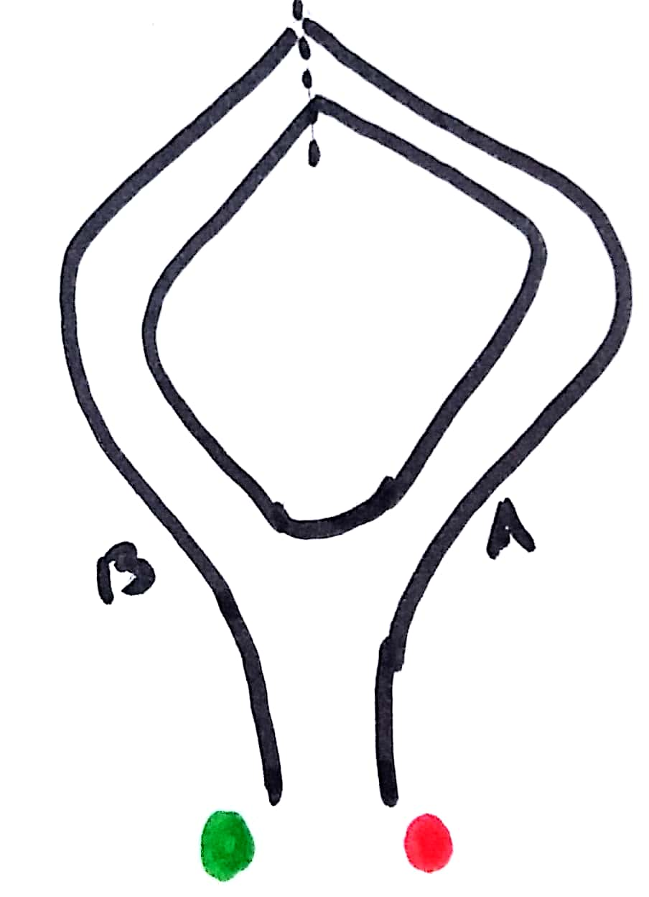
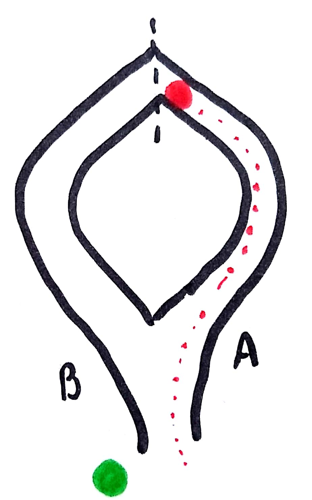
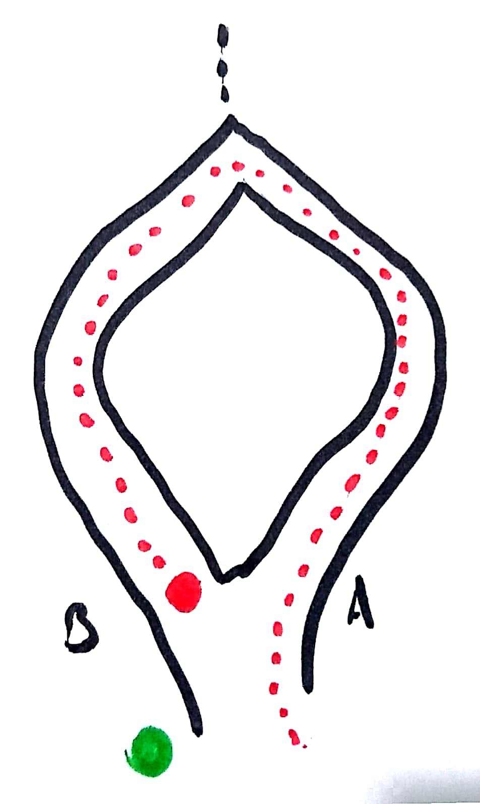

<!--{section^1:data-breadcrumb="Concepts"}-->

<!--{.interleaf data-background-image="/img/unsplash/71909.jpg"}-->
<!-- Photo by Patrick Tomasso on Unsplash -->

## <svg class="icon"><use xlink:href="/img/icons.svg#dots-two-vertical"></svg>  Concevoir une architecture "sans connaissance"

===

Donnée
: information produite par l'utilisateur•trice

Client
: app avec lequel interagit l'utilisateur•trice

Service
: entité externe qui cherche à utiliser la donnée

Paire de clefs
: clefs de chiffrement asymétriques (RSA / EC)

Certificat
: carte d'identité virtuelle du Client / Service

Serveur
: garantit les identités et passe les données

===

### Concepts

- Authentification à _preuve nulle_ {.fragment}
- Chiffrement bout en bout {.fragment}
- Données chiffrées exclusivement {.fragment}
- Approche non-naïve {.fragment}
{.x-large}

===

### Comment ça fonctionne ?

@[giphy]({"token": "26u4lOMA8JKSnL9Uk", "className":"medium"})

===

#### Zero Knowledge

1. <i class="fas fa-fingerprint"></i> Mot de passe
2. <i class="fas fa-id-card"></i> Certificat intermédiaire, signé par le CER racine de l'app sur le serveur {.fragment .fade-up}
3. <i class="fas fa-key"></i> Deux paires de clefs : authentification (signature), donnée (chiffrement) {.fragment .fade-up}
4. <i class="fas fa-server"></i> Clefs publiques / hash des clefs privées envoyées sur le serveur {.fragment .fade-up}
5. <i class="fas fa-mobile-alt"></i> Clefs privées stockées dans le client, avec certificat intermédiaire {.fragment .fade-up}
{.x-small .icons}

===
<!--{.punchline}-->

#### Authentification à preuve nulle
<!--{h4:.large}-->

===

La Caverne d'Ali Baba {.large}

::{.x-small}::
::{.x-small}::{.fragment .current-visible}
::{.x-small}::{.fragment .current-visible}
<!--{p:.over}-->

Ceci est une caverne (vraiment)
<!--{p:.x-small}-->

===

Gestion des clefs {.x-large}

- <i class="fas fa-id-card"></i> un certificat intermédiaire par Service {.fragment .fade-up}
- <i class="fas fa-key"></i> deux paires de clefs par Service {.fragment .fade-up}
- <i class="fas fa-handshake "></i> la paire de signature est utilisée dans un challenge d'auth {.fragment .fade-up}

{.x-small .icons}

===

Preuve à connaissance nulle {.x-large}

1. Le service qui souhaite s'authentifier se présente au serveur {.fragment .fade-up}
2. Le serveur teste sa signature dans un challenge {.fragment .fade-up}
3. Le serveur produit un token unique pour le lien Client / Service {.fragment .fade-up}
4. Le client s'appuie sur le token pour valider le service qui se présente {.fragment .fade-up}
{.medium}

===
<!--{.large}-->

**Sécurité** {.large}

- aucun échange de mot de passe
- les clefs sont révocables via les certificats intermédiaires

===
<!--{.punchline}-->

#### Chiffrement (E2EE)
<!--{h4:.large}-->

===
<!--{.large}-->

Chiffrement {.large}

- côté client ==uniquement== {.fragment .fade-up}
- avec la clef publique ==du service== {.fragment .fade-up}
- avec de ==l'encapsulation== de clef symétrique {.fragment .fade-up}

===
<!--{.large}-->

Déchiffrement {.large}

- dans le service {.fragment .fade-up}
- avec la clef privée du service {.fragment .fade-up}

===
<!--{.large}-->

**Sécurité** {.large}

- chaque clef synchrone est unique par blob / service / client
- la clef synchrone est un _datetime token_

===
<!--{.punchline}-->

#### Approche non-naïve
<!--{h4:.large}-->

===

Document : arborescence de données

<svg width="600" height="600" viewBox="0 0 200 200" xmlns="http://www.w3.org/2000/svg"><path d="M137.33 35.14a4.05 4.05 0 0 0 4.04 4.05h29.77c-.31-.4-.61-.82-.97-1.18L138.51 6.35c-.36-.36-.78-.66-1.18-.97v29.76zm0 0" fill="#fff"/><path d="M140.37 47.27c-6.69 0-12.13-5.44-12.13-12.13V2.79H39.31c-6.72 0-12.13 5.46-12.13 12.13v169.61c0 6.67 5.41 12.13 12.13 12.13l117.65.08c4.2 0 8.16-1.62 11.15-4.61 2.96-2.95 4.61-6.92 4.61-11.12V47.27h-32.35zm0 0" stroke-width="4" stroke="#fff" stroke-linecap="round" stroke-linejoin="round" fill="none"/><path d="M51.43 43.17h32.34v8.09H51.43v-8.09zm0 0" stroke-width="4" stroke="#fb0006" stroke-linecap="round" stroke-linejoin="round" fill="#fb0006" class="fragment"/><path d="M51.43 67.43h97.03v8.09H51.43v-8.09zm0 0M51.43 91.69h97.03v8.08H51.43v-8.08zm0 0" stroke-width="4" stroke="#f90" stroke-linecap="round" stroke-linejoin="round" fill="#f90" class="fragment"/><path d="M75.68 172.55H51.43v-8.09h24.25v8.09zm0 0M91.86 148.29H51.43v-8.09h40.43v8.09zm0 0M108.03 124.03h-56.6v-8.08h56.6v8.08zm0 0" stroke-width="4" stroke="#09f" stroke-linecap="round" stroke-linejoin="round" fill="#09f" class="fragment"/><path d="M156.54 173.54c0 4.46-3.62 8.09-8.08 8.09h-28.3c-4.46 0-8.09-3.63-8.09-8.09v-37.38c0-4.46 3.63-8.09 8.09-8.09h28.3c4.46 0 8.08 3.63 8.08 8.09v37.38zm0 0" stroke-width="4" stroke="#0c0" stroke-linecap="round" stroke-linejoin="round" fill="#0c0" class="fragment"/><path d="M136.46 75.52h-24v-8.09h24v8.09zm0 0M136.46 99.77h-24v-8.08h24v8.08zm0 0" stroke-width="4" stroke="#f0c" stroke-linecap="round" stroke-linejoin="round" fill="#f0c" class="fragment"/></svg>

===

**Sécurité** {.x-large}

- pas de partage intégral du document
- chaque blob est chiffré unitairement / par service / clef unique
- la granularité est la plus fine possible
- stockage cloud, chiffré, sans clef disponible
- pas d'accès aux ressources interdites
{.medium}

*[E2EE]: End-To-End Encryption
